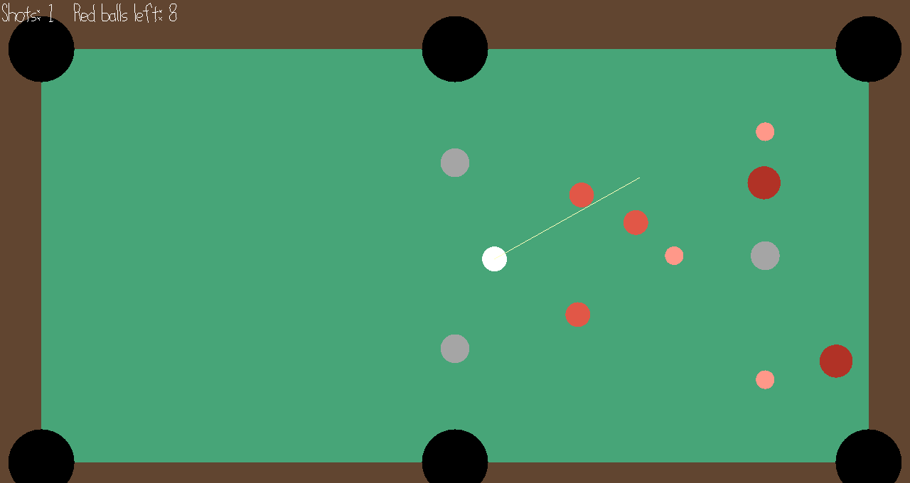

# Chain Shot

Author: Deming Xu

Design: Billiards where the balls have different weights and there are fixed posts on the table. One shot can start a long chain of hits, and a small change in aim gives a very different result.

Screen Shot:



How To Play:

Move the mouse to aim. The farther the mouse is from the white ball, the harder the shot. Click to shoot. Sink all red balls in as few shots as you can. Darker red balls are heavier. If the white ball goes in, it comes back when everything stops. Hold Z to rewind. Press R to restart.

## Extra Credit

Are your Physics Deterministic? If so, how can we verify this?

Yes. The physics uses only integer math with a fixed step of 1/240 s, and no steps run while all balls are at rest. So the game state depends only on the shots. Run:

```
dist/game --replay replay.txt
```

This plays the shots in `replay.txt` without opening a window and prints a hash of the state after each shot. It should print:

```
shots=1 left=8 steps=269 hash=d24083f8ef4e1e8c
shots=2 left=8 steps=577 hash=fa1bce19a737de37
shots=3 left=8 steps=902 hash=d9531cd17aa12375
```

When you play, the game prints the same kind of hash each time the balls stop and saves your shots to `last-replay.txt`. Run `dist/game --replay last-replay.txt` on another machine to get the same hashes, or `dist/game --watch last-replay.txt` to watch the shots again in a window.

Are your Physics Rewindable? If so, how can we verify this?

Yes. The game saves the state at every step. Take a shot, then hold Z. The balls move backward, and the shot count goes down once you pass the start of a shot. Release Z when the balls are at rest and take a different shot.

This game was built with [NEST](NEST.md).
